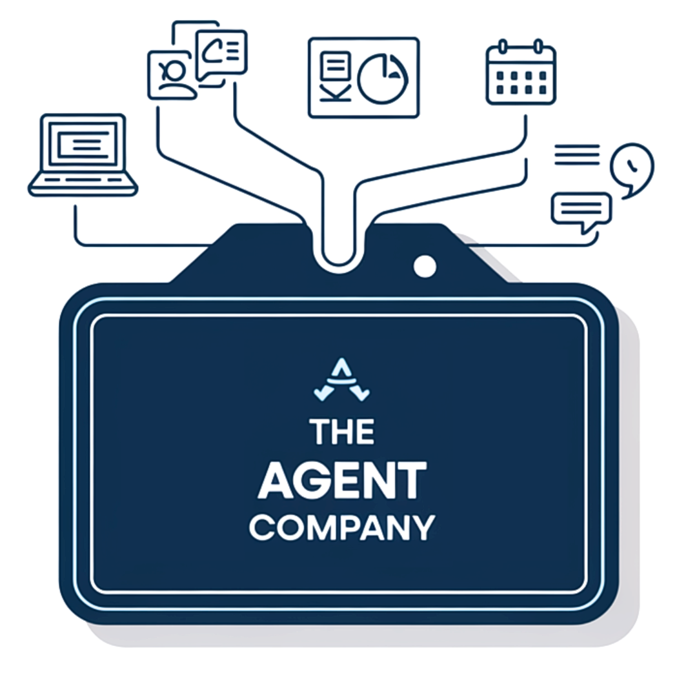

  
  <h1 align="center">The Agent Company: Benchmarking LLM Agents on Consequential Real World Tasks</h1>

    
    

Please refer to the [website](https://the-agent-company.com/) for more details.

## Overview
TODO, paste paper content here

## Set Up
Check out the [docs](./docs/SETUP.md) for more details.

## Exciting Features

- Diverse task roles:
  - Software Engineer
  - Product Manager
  - Data Scientist
  - Human Resource
  - Financial Staff
  - Administrator
- Diverse data types:
  - Coding tasks
  - Conversational tasks
  - Mathematical reasoning
  - Image processing
  - Text comprehension
- Multiple Agent Interaction
- Comprehensive scoring system
  - Result-based evaluation (primary)
  - Subcheckpoints checking (secondary)
- Multiple evaluation methods:
  - Deterministic evaluators
  - LLM-based evaluators
- Simple one-command operations:
  - Complete environment setup in minutes
  - Quick system reset in minutes when needed
- Extensible benchmark framework
  - Add new tasks/evaluators/subcheckpoints in minutes

# Contribution
We welcome any contributions to bug fixes, documentation, and other improvements.
Questions? Please create an issue. Otherwise, you can also contact [Frank F. Xu](https://frankxfz.me/), [Yufan Song](https://github.com/yufansong), [Boxuan Li](https://github.com/li-boxuan) (Email: fangzhex@cs.cmu.edu, yufans@alumni.cmu.edu, boxuanli@alumni.cmu.edu)

## Cite
TODO

## License
Distributed under the [MIT](./LICENSE) License. See LICENSE for more information.
