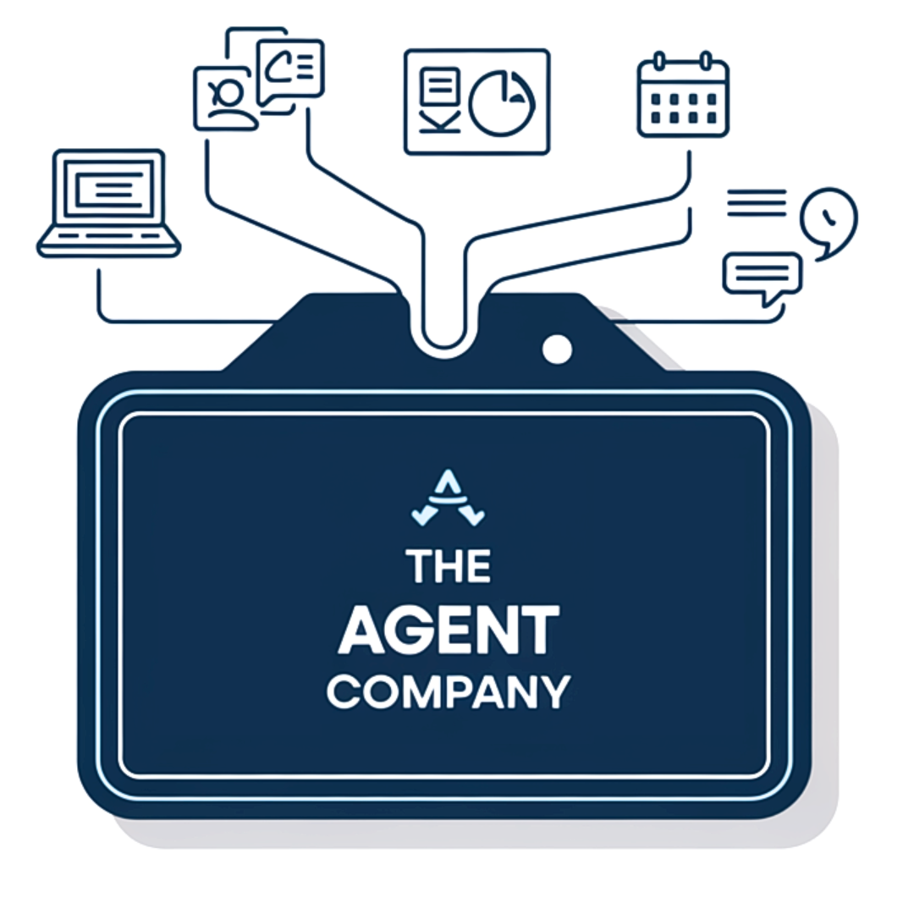
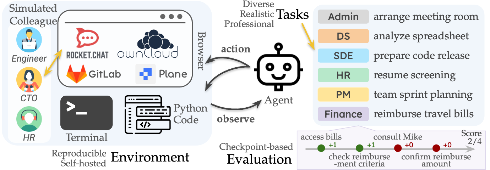

<a name="readme-top"></a>

<div align="center">
  
  <h1 align="center">The Agent Company: Benchmarking LLM Agents on Consequential Real World Tasks</h1>
</div>


<p align="center">
    <a href="https://github.com/TheAgentCompany/TheAgentCompany/blob/main/LICENSE">
        
    </a>
</p>


<p align="center">
<a href="https://the-agent-company.com/">Website</a> •
<a href="https://arxiv.org/abs/2412.14161">Paper</a> •
<a href="https://the-agent-company.com/#/leaderboard">Leaderboard</a>
</p>

## Overview

We interact with computers on an everyday basis, be it in everyday life or work, and many aspects of work can be done entirely with access to a computer and the Internet.
At the same time, thanks to improvements in large language models (LLMs), there has also been a rapid development in AI agents that interact with and affect change in their surrounding environments.
But how performant are AI agents at helping to accelerate or even autonomously perform work-related tasks?
The answer to this question has important implications for both industry looking to adopt AI into their workflows, and for economic policy to understand the effects that adoption of AI may have on the labor market.
TheAgentCompany measures the progress of these LLM agents' performance on performing real-world professional tasks,
by providing an extensible benchmark for evaluating AI agents that interact with the world in similar ways to those of a digital worker: by browsing the Web, writing code, running programs, and communicating with other coworkers.

<div align="center">
  
</div>


## Quick Start


### Step 1: Setup the Servers

Servers can be hosted locally or on the cloud in a few minutes.

```bash
# you should have docker and docker compose installed, and 30+ GB of free disk space
sudo chmod 666 /var/run/docker.sock
curl -fsSL https://github.com/TheAgentCompany/the-agent-company-backup-data/releases/download/setup-script-20241208/setup.sh | sh
```

After a few minutes, you should have all services running, including GitLab, Plane, ownCloud, RocketChat,
all with pre-baked data. Please check out the [SERVER SETUP DOC](./docs/SETUP.md) for more details and troubleshooting guide.

### Step 2: Run the Benchmark

Every task is a Docker image with the following structure:

```
/utils
├── evaluator.py.enc
├── init.sh
├── config.py
├── common.py
├── eval.py
├── npc
├── ...
/instruction
├── task.md
├── ...
/workspace
├── ...
```

where `/utils/init.sh` is the script you must run to initialize the task environment,
`/utils/eval.py` is the entrypoint to run the grading functions, and
`/instruction/task.md` is the task instruction for the examinee, i.e. your agent.

#### Benchmark with OpenHands

If you want to run the benchmark using the [OpenHands](https://github.com/all-hands-ai/openhands) platform, it's as simple as:

```bash
cd evaluation
# set up agent and environment LLM configs in config.toml, omitted
bash run_eval.sh \
  --agent-llm-config <group1> \
  --env-llm-config <group2> \
  --outputs-path <outputs> \
  --server-hostname <hostname> \
  --version 1.0.0
```

Please check out [this doc](./evaluation/README.md) for more details.

#### Benchmark with other Platforms

This applies if you are using agents not from OpenHands, or want to run the benchmark manually by
human testers.

##### Step 2.1: Start Task Container

```bash
docker run --name <container_name> -it <image_name> /bin/bash
```

A complete list of 175 task images can be found [here](./workspaces/README.md).

##### Step 2.2: Initialize the Task Environment

```bash
SERVER_HOSTNAME=<hostname, default value is localhost> \
LITELLM_API_KEY=<environment_llm_api_key> \
LITELLM_BASE_URL=<environment_llm_base_url> \
LITELLM_MODEL=<environment_llm_model_name> \
bash /utils/init.sh
```

##### Step 2.3: Conduct the Task

Now you can prompt the agent to work on the task. The task instruction is in `/instruction/task.md`.

> Complete the task in /instruction/task.md

##### Step 2.4: Grade the Result

```bash
LITELLM_API_KEY=<environment_llm_api_key> \
LITELLM_BASE_URL=<environment_llm_base_url> \
LITELLM_MODEL=<environment_llm_model_name> \
DECRYPTION_KEY='theagentcompany is all you need' \
python_default /utils/eval.py --trajectory_path TRAJECTORY_PATH --output_path OUTPUT_PATH
```

Please check out the [EVALUATION DOC](./docs/EVALUATION.md) for more details.

## Exciting Features

- Diverse task roles:
  - Software Engineer
  - Product Manager
  - Data Scientist
  - Human Resource
  - Financial Staff
  - Administrator
- Diverse data types:
  - Coding tasks
  - Conversational tasks
  - Mathematical reasoning
  - Image processing
  - Text comprehension
- Multiple Agent Interaction
- Comprehensive scoring system
  - Result-based evaluation (primary)
  - Subcheckpoints checking (secondary)
- Multiple evaluation methods:
  - Deterministic evaluators
  - LLM-based evaluators
- Simple one-command operations:
  - Complete environment setup in minutes
  - Quick system reset in minutes when needed
- Extensible benchmark framework
  - Add new tasks/evaluators/subcheckpoints in minutes


## Cite
```
@misc{xu2024theagentcompanybenchmarkingllmagents,
      title={TheAgentCompany: Benchmarking LLM Agents on Consequential Real World Tasks}, 
      author={Frank F. Xu and Yufan Song and Boxuan Li and Yuxuan Tang and Kritanjali Jain and Mengxue Bao and Zora Z. Wang and Xuhui Zhou and Zhitong Guo and Murong Cao and Mingyang Yang and Hao Yang Lu and Amaad Martin and Zhe Su and Leander Maben and Raj Mehta and Wayne Chi and Lawrence Jang and Yiqing Xie and Shuyan Zhou and Graham Neubig},
      year={2024},
      eprint={2412.14161},
      archivePrefix={arXiv},
      primaryClass={cs.CL},
      url={https://arxiv.org/abs/2412.14161}, 
}
```

## Contribution
We welcome any contributions to bug fixes, documentation, and other improvements.
Questions? Please create an issue. Otherwise, you can also contact [Frank F. Xu](https://frankxfz.me/), [Yufan Song](https://github.com/yufansong), [Boxuan Li](https://github.com/li-boxuan) (Email: fangzhex@cs.cmu.edu, yufans@alumni.cmu.edu, boxuanli@alumni.cmu.edu)

## License
Distributed under the [MIT](./LICENSE) License. See LICENSE for more information.
